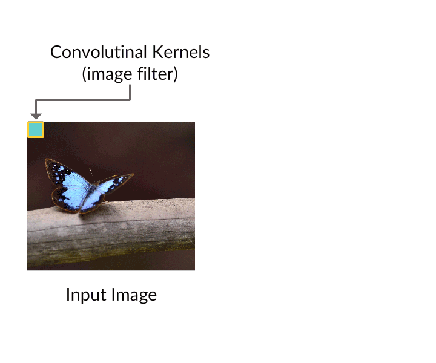

# Convolution Using PyTorch

* Convolution operations are used to extract specific patterns from the image by passing the image through a set of filters.
* For the first few cards, let's explore PyTorch's convolution operation by defining four filters and apply them on an image.

## Read Image file

* Import image of your choice using [cv2](https://opencv-python-tutroals.readthedocs.io/en/latest/py_tutorials/py_gui/py_image_display/py_image_display.html).
* The imported image has to be converted from byte stream to float values in order to perform convolution operation.

```
import cv2
import matplotlib.pyplot as plt
%matplotlib inline
### define file path
img_path = 'data/lane.jpg'
# load color image 
bgr_img = cv2.imread(img_path)
# convert to grayscale
gray_img = cv2.cvtColor(bgr_img, cv2.COLOR_BGR2GRAY)
# normalize, rescale entries to lie in [0,1]
gray_img = gray_img.astype("float32")
# plot image
plt.imshow(gray_img, cmap='gray')
plt.show()
```
## Define Filters

* In case of CNN, filters are the parameters that are used to extract patterns from the images.
* As an example, let us define the filters manually to extract vertical and horizontal patterns from the image.

```
import numpy as np
filter_vals = np.array([[-1, -1, 1, 1], [-1, -1, 1, 1], [-1, -1, 1, 1], [-1, -1, 1, 1]])

# define four filters

filter_1 = filter_vals
filter_2 = -filter_1
filter_3 = filter_1.T
filter_4 = -filter_3
filters = np.array([filter_1, filter_2, filter_3, filter_4])
```
## Define Convolution Layer
* Now, we have the image as well as the filters need for a convolution operation.
* We define the convolution layer using [nn.Conv2d](https://pytorch.org/docs/stable/nn.html#torch.nn.Conv2d) as shown in the below.
```
class Net(nn.Module):
    
    def __init__(self, weight):
        super(Net, self).__init__()
        # initializes the weights of the convolutional layer to be the weights of the 4 defined filters
        k_height, k_width = weight.shape[2:]
        # assumes there are 4 grayscale filters
        self.conv = nn.Conv2d(1, 4, kernel_size=(k_height, k_width), bias=False)
                ### Defining the filter parameters explicitly
        self.conv.weight = torch.nn.Parameter(weight)
```
* Since we are dealing with single channel gray-scale image and convolving it with four different filters, the `in_channels and out_channels` are 1 and 4, respectively.
* The `kernel_size` defines the height and width of filters.

## Defining Forward Pass
* Once we have defined convolution layer, it is time to perform the convolution operation followed by an activation.
```
def forward(self, x):
        # calculates the output of a convolutional layer
        # pre- and post-activation
        conv_x = self.conv(x)
        activated_x = F.relu(conv_x)
        
        # returns both layers
        return conv_x, activated_x
```
* Instantiate the model and set the weights.
```
weight = torch.from_numpy(filters).unsqueeze(1).type(torch.FloatTensor)
model = Net(weight)
print(model)
Output:
Net(
  (conv): Conv2d(1, 4, kernel_size=(4, 4), stride=(1, 1), bias=False)
)
```
## Output
* Let's look at the output of a convolutional layer, before and after an activation function is applied.
```
# convert the image into an input Tensor
gray_img_tensor = torch.from_numpy(gray_img).unsqueeze(0).unsqueeze(1)
print("input shape ", gray_img_tensor.shape)   
Output: 
input shape  torch.Size([1, 1, 720, 1280])

# get the convolutional layer (pre and post activation)
conv_layer, activated_layer = model(gray_img_tensor)
print("output shape", conv_layer.shape)
Output:
output shape torch.Size([1, 4, 717, 1277])
```
* The spatial size of the output volume is a function of the input volume size (W), the filter size (F), the stride with which they are applied (S), and the amount of zero padding used (P) is given by `(W−F+2P)/S + 1`.

## Output After Convolution

* The above images are the result of convolution operation before and after applying activation on convolved output.

## Cifar10 Dataset
* Now that you have seen basic operations on convolution using PyTorch let us implement these operations to build a model to predict the image labels from [Cifar10](https://www.cs.toronto.edu/~kriz/cifar.html) dataset.
* The images in this database are small color images that fall into one of the ten classes; some example images are shown in the above image.

## Importing Image Data
* We use the same torchvision package to import the Cifar 10 dataset.
* However, this time, since we are dealing with images, we introduce some data augmentation on an image like random flipping and rotating the image data.
* We do this by defining a torchvision transform, and you can learn about all the transforms that are used to pre-process and augment data [here](https://pytorch.org/docs/stable/torchvision/transforms.html).
```
from torchvision import datasets
import torchvision.transforms as transforms

transform = transforms.Compose([
    transforms.RandomHorizontalFlip(), # randomly flip and rotate
    transforms.RandomRotation(10),
    transforms.ToTensor(),
    transforms.Normalize((0.5, 0.5, 0.5), (0.5, 0.5, 0.5))
    ])

train_data = datasets.CIFAR10('data', train=True,
                              download=True, transform=transform)
test_data = datasets.CIFAR10('data', train=False,
                             download=True, transform=transform)
```
## Loading the Dataset
* This step is similar to the one you performed for the MNIST data.
* We use `torch.utils.data.DataLoader` to load the images in batches.
* Data augmentation is performed on the go when you start through images using the data loader.
```
train_loader = torch.utils.data.DataLoader(train_data,  batch_size = 64)
test_loader = torch.utils.data.DataLoader(test_data,  batch_size = 64)
```
## CNN Architecture
* Now, we build a CNN model using the following properties
  * [Convolutional layers](https://pytorch.org/docs/stable/nn.html#conv2d), which can be thought of as a stack of filtered images.
  * [Maxpooling layers](https://pytorch.org/docs/stable/nn.html#maxpool2d), which reduce the x-y size of the input, keeping only the most active pixels from the previous layer.
  * The usual Linear + Dropout layers to avoid overfitting and produce a 10-dim output.
* This topic shows you how to define a CNN model using PyTorch, all the steps regarding model evaluation will be the same as what you used for the feedforward network.

## Adding Convolution and Pooling Layers
```
import torch.nn as nn
import torch.nn.functional as F

# define the CNN architecture
class Net(nn.Module):
    def __init__(self):
        super(Net, self).__init__()
       # convolutional layer (sees 32x32x3 image tensor)
        self.conv1 = nn.Conv2d(3, 16, 3, padding=1)
    # convolutional layer (sees 16x16x16 tensor)
        self.conv2 = nn.Conv2d(16, 32, 3, padding=1)
        # convolutional layer (sees 8x8x32 tensor)
        self.conv3 = nn.Conv2d(32, 64, 3, padding=1)
        # max pooling layer
        self.pool = nn.MaxPool2d(2, 2)
```
## Appending FC Layer
* The output from convolution layer is a 2-D tensor that is flattened and fed to fully connected (FC) layers.
* As a part of the previous codes, let's define FC layers as shown below.
```
# linear layer (64 * 4 * 4 -> 500)
self.fc1 = nn.Linear(64 * 4 * 4, 500)
# linear layer (500 -> 10)
self.fc2 = nn.Linear(500, 10)
# dropout layer (p=0.25)
self.dropout = nn.Dropout(0.25)
```
* The [nn.Dropout(0.25)](https://pytorch.org/docs/stable/nn.html#torch.nn.Dropout) implements the dropout with probability 0.25 to avoid overfitting.

## Forward Pass
* Once we have all the convolution and FC layers defined, we use these layers to define the forward propagation.
* Within the class net we define the forward method as
```
def forward(self, x):
        # add sequence of convolutional and max pooling layers
        x = self.pool(F.relu(self.conv1(x)))
        x = self.pool(F.relu(self.conv2(x)))
        x = self.pool(F.relu(self.conv3(x)))
        # flatten image input
        x = x.view(-1, 64 * 4 * 4)
        # add dropout layer
        x = self.dropout(x)
        # add 1st hidden layer, with relu activation function
        x = F.relu(self.fc1(x))
        # add dropout layer
        x = self.dropout(x)
        # add 2nd hidden layer, with relu activation function
        x = self.fc2(x)
        return x
```
* Create a model
```
model = Net()
print(model)
```
